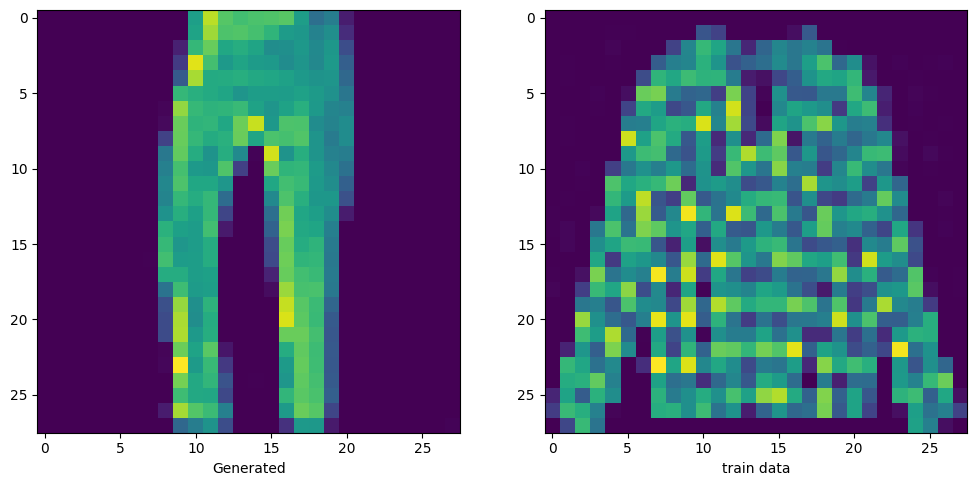
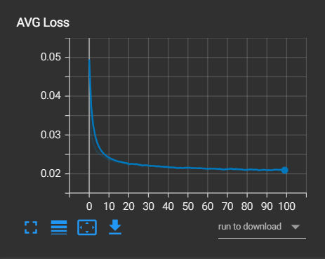
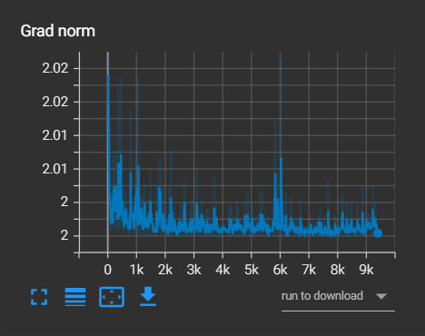

# 🎨 DDPM from Scratch using PyTorch

A PyTorch implementation of a **Denoising Diffusion Probabilistic Model (DDPM)** built from scratch using a custom U-Net architecture.

The project implements the complete diffusion pipeline, including the forward noising process, timestep conditioning, noise prediction, and reverse diffusion for image generation.

The model was experimented with on both **MNIST** and **Fashion-MNIST**.

---

## 📌 Features

- ✅ DDPM implemented from scratch
- ✅ Custom U-Net architecture
- ✅ Sinusoidal Time Embeddings
- ✅ Forward Diffusion
- ✅ Reverse Diffusion
- ✅ Custom noise prediction network
- ✅ MNIST experiment
- ✅ Fashion-MNIST experiment
- ✅ TensorBoard logging
- ✅ Image sampling during training
- ✅ AdamW optimizer
- ✅ Gradient clipping

---

## 🧠 How DDPM Works

DDPM learns to generate images by learning how to reverse a gradual Gaussian noising process.

```text
Original Image
      │
      ▼
Forward Diffusion
(Add Gaussian Noise)
      │
      ▼
Noisy Image
      │
      ▼
   U-Net
(Time Conditioned)
      │
      ▼
Predicted Noise
      │
      ▼
Reverse Diffusion
      │
      ▼
Generated Image
````

During training, noise is progressively added to an image. The U-Net receives the noisy image along with a time embedding and learns to predict the noise that was added.

---

## 🏗️ Architecture

The project uses a custom U-Net architecture:

```text
Input
  │
  ▼
Down Block (64)
  │
  ▼
Down Block (128)
  │
  ▼
Down Block (256)
  │
  ▼
Bottleneck (512)
  │
  ▼
Up Block (256)
  │
  ▼
Up Block (128)
  │
  ▼
Up Block (64)
  │
  ▼
Predicted Noise
```

The network is conditioned on the diffusion timestep using **Sinusoidal Time Embeddings**.

---

## 📊 Datasets

### MNIST

* Training Images: 60,000
* Image Size: `28 × 28`
* Channels: `1`
* Training Epochs: **100**

### Fashion-MNIST

* Training Images: 60,000
* Image Size: `28 × 28`
* Channels: `1`
* Training Epochs: **1**

The model was tested on both datasets to compare its behavior on handwritten digits and clothing images.

---

## 🏋️ Training

### Loss Function

The model uses **Mean Squared Error (MSE)** between the actual noise and the noise predicted by the U-Net.

```text
MSE(Predicted Noise, Actual Noise)
```

### Optimizer

```text
AdamW
```

### Learning Rate

```text
1e-4
```

### Diffusion Steps

```text
1000
```

### Training Configuration

| Dataset       | Epochs | Average Loss |
| ------------- | -----: | -----------: |
| MNIST         |    100 |  **0.02008** |
| Fashion-MNIST |      1 |  **0.06656** |

---

## 📈 Results

### MNIST

After training for **100 epochs**, the model achieved an average training loss of approximately:

```text
0.02008
```

### Fashion-MNIST

After training for **1 epoch**, the model achieved an average training loss of approximately:

```text
0.06656
```

The Fashion-MNIST experiment was trained for only one epoch as an initial experiment on a more visually complex dataset compared with MNIST.

> **Note:** The reported values are training losses and should not be interpreted as direct measures of image-generation quality. Generated samples provide a more useful qualitative evaluation.

---

## 🖼️ Generated Samples

Example generated samples and comparisons:



---

## 📊 TensorBoard

### Loss



### Generated Images



TensorBoard logs are stored in:

```text
Logs/
```

Run TensorBoard with:

```bash
tensorboard --logdir Logs
```

---

## 📁 Project Structure

```text
.
├── Data/
├── images/
├── Logs/
├── ddpm.ipynb
├── ddpm_fashion_mnist.pt
├── ddpm_mnist_digits.pt
├── assets/
├── requirements.txt
└── README.md
```

---

## 🚀 Run the Project

### 1. Clone the repository

```bash
git clone https://github.com/ziadTeama-dev/pytorch-ddpm-from-scratch.git
```

### 2. Install dependencies

```bash
pip install -r requirements.txt
```

### 3. Run the notebook

```bash
jupyter notebook ddpm.ipynb
```

---

## 🔬 Future Improvements

* DDIM Sampling
* Class-Conditional DDPM
* CIFAR-10 Training
* Exponential Moving Average (EMA)
* Mixed Precision Training
* Cosine Noise Schedule
* Attention U-Net
* Longer Fashion-MNIST training
* Improved sampling strategies

---

## 🛠️ Technologies

* Python
* PyTorch
* Torchvision
* TensorBoard
* Matplotlib
* Jupyter Notebook

---

## 👤 Author

**Ziad Abdelhaliem Teama**


